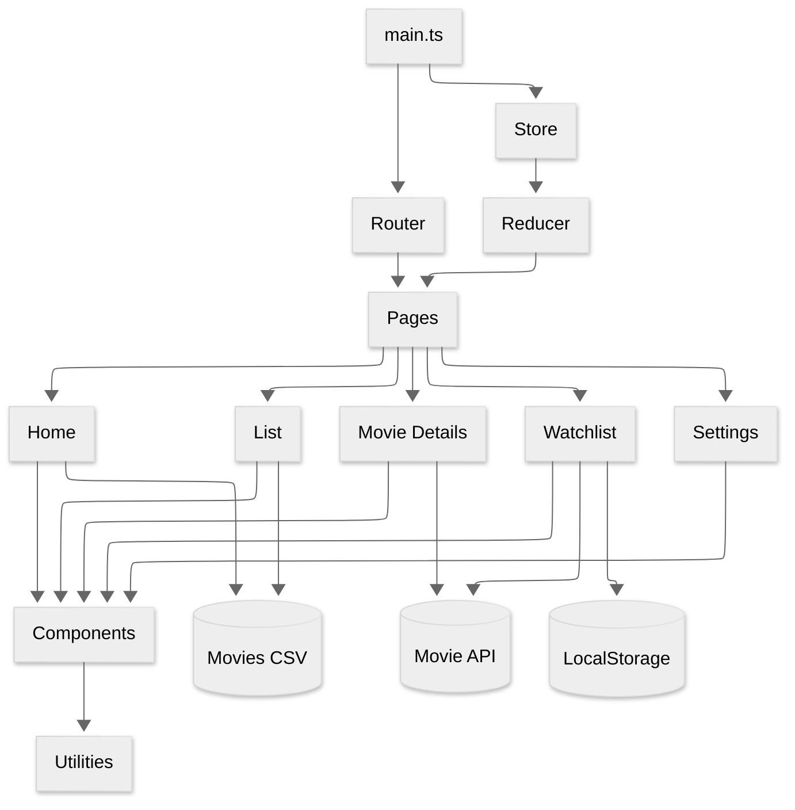

# Component Diagram

```mermaid
---
config:
  layout: elk
  theme: neutral
  look: neo
---
flowchart TB
    A["main.ts"] --> B["Router"] & C["Store"]
    B --> D["Pages"]
    D --> E["Home"] & F["List"] & G["Movie Details"] & H["Watchlist"] & I["Settings"]
    E --> J["Components"] & L[("Movies CSV")]
    F --> J & L
    G --> J & M[("Movie API")]
    H --> J & M & N[("LocalStorage")]
    I --> J
    J --> K["Utilities"]
    C --> O["Reducer"]
    O --> D
```
